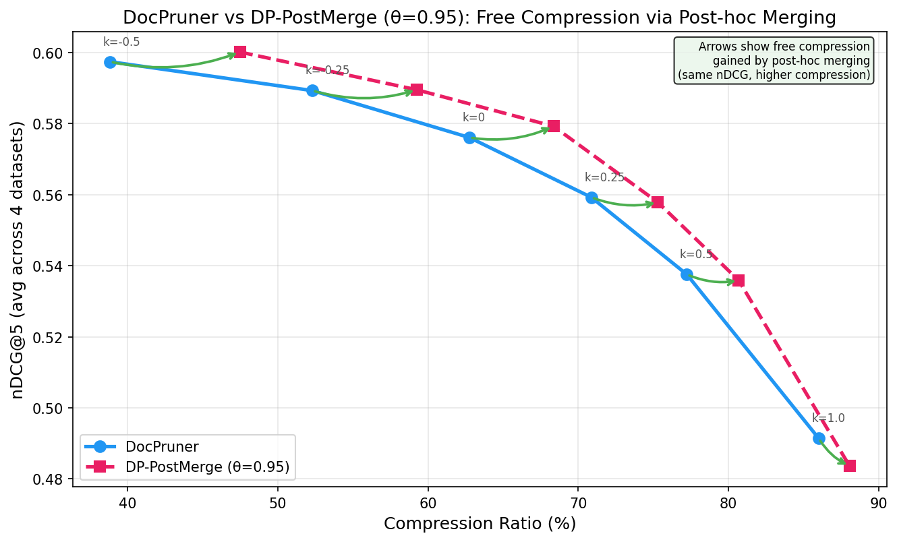
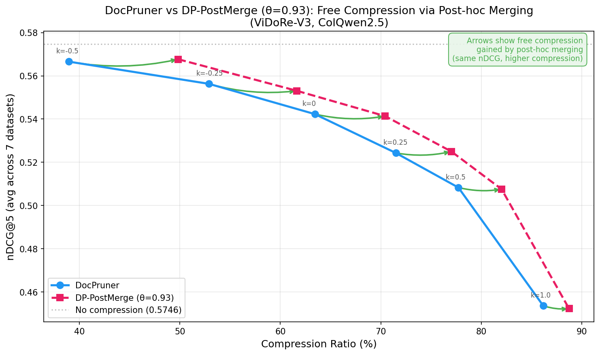

# DP-PostMerge: Free Compression via Post-hoc Merging for Multi-Vector Visual Document Retrieval

## Overview

Multi-vector Visual Document Retrieval (VDR) systems represent each document page as hundreds of patch-level embeddings, achieving state-of-the-art retrieval quality but incurring prohibitive storage overhead. DocPruner (Yan et al., 2025) addresses this via adaptive pruning using EOS attention thresholding, but selects patches by importance alone — leaving redundancy among kept patches unexploited.

**DP-PostMerge** adds a simple post-hoc merge step after DocPruner: greedily merge near-duplicate kept patches (cosine similarity > θ) via attention-weighted averaging. This yields **3–10% extra compression for free** at every operating point, with negligible quality loss.

## Key Results

| k | DocPruner nDCG@5 | DocPruner Compress. | DP-PostMerge nDCG@5 | DP-PostMerge Compress. | Free Δ |
|---|------------------|---------------------|---------------------|------------------------|--------|
| −0.50 | 0.598 | ~38% | **0.600** | ~48% | **+10%** |
| −0.25 | 0.589 | ~52% | 0.590 | ~59% | **+7%** |
| 0.00 | 0.577 | ~62% | 0.579 | ~69% | **+7%** |
| 0.25 | 0.560 | ~71% | 0.558 | ~76% | **+5%** |
| 0.50 | 0.538 | ~77% | 0.537 | ~81% | **+4%** |
| 1.00 | 0.491 | ~86% | 0.484 | ~89% | **+3%** |

*ViDoRe-V2, avg across 4 datasets, ColQwen2.5, θ=0.95*





Generalizes to ViDoRe-V3 (7 datasets) with no hyperparameter tuning.

See [docs/exp_results.md](docs/exp_results.md) for full results.

## Method

```
1. Run DocPruner(k) as normal → kept patches {d₁, ..., dₘ} with attention scores
2. Compute pairwise cosine similarity among kept patches
3. Greedy merge: highest-attention patch absorbs neighbors with cos sim > θ
   via attention-weighted average
4. Return merged result → fewer patches, same retrieval quality
```

**Key insight:** DocPruner filters by importance, not redundancy. Kept patches in dense embedding regions are often near-identical. Merging them loses almost no retrieval signal but reduces vector count.

**Properties:**
- Zero training cost — no learned parameters
- Model-agnostic — works on any multi-vector retrieval model
- Composable — applies on top of any pruning method
- Single hyperparameter — cosine similarity threshold θ (0.93–0.95)
- Negligible runtime — pairwise cosine on already-pruned patches

## Experiment Scope

| | Choice | Rationale |
|---|--------|-----------|
| Benchmarks | ViDoRe-V2 (4 datasets), ViDoRe-V3 (7 datasets) | Standard VDR benchmarks |
| Model | ColQwen2.5 (`vidore/colqwen2.5-v0.2`) | Most widely used |
| Metric | nDCG@5 | Standard in VDR literature |
| Hardware | MacBook Pro 36GB (MPS), HPC 4× L40 (CUDA) | |

## Project Structure

```
project_6765/
├── readme.md
├── pyproject.toml                  # uv-managed dependencies
├── docpruner_replicate.py          # Legacy all-in-one script
├── benchmark/                      # Modular benchmark framework
│   ├── experiment.py               # run_experiment() / run_sweep()
│   ├── model.py                    # ColQwen2.5 loading + encoding
│   ├── data.py                     # Dataset loading (ViDoRe-V2/V3)
│   ├── eval.py                     # nDCG@5 evaluation
│   ├── plot.py                     # Result plotting
│   └── methods/                    # Compression methods
│       ├── docpruner.py            # DocPruner baseline
│       ├── dp_postmerge.py         # DP-PostMerge (final method)
│       ├── dp_dedup.py             # DP-Dedup variant
│       ├── dp_residual.py          # DP-Residual (explored)
│       ├── docmerger.py            # DocMerger (explored)
│       └── ...                     # Other explored methods
├── docs/
│   ├── exp_results.md              # Full experiment results + analysis
│   ├── research_plan.md            # Research directions
│   └── posters/                    # Conference poster (HTML)
├── results/
│   └── figures/                    # Generated plots
└── .kiro/
    └── skills/                     # Kiro CLI skills
```

## Quick Start

```bash
# Install dependencies
uv sync

# Run DocPruner baseline
uv run python -c "
from benchmark.experiment import run_experiment
run_experiment({'dataset': 'vidore/esg_reports_v2', 'pruner': 'docpruner', 'k': -0.25})
"

# Run DP-PostMerge
uv run python -c "
from benchmark.experiment import run_experiment
run_experiment({
    'dataset': 'vidore/esg_reports_v2',
    'pruner': 'dp_postmerge',
    'k': -0.25,
    'merge_threshold': 0.95,
})
"

# Sweep all k values on one dataset
uv run python -c "
from benchmark.experiment import run_sweep
run_sweep([
    {'dataset': 'vidore/esg_reports_v2', 'pruner': 'dp_postmerge', 'k': k, 'merge_threshold': 0.95}
    for k in [-0.5, -0.25, 0, 0.25, 0.5, 1.0]
])
"
```

Embeddings are cached after the first run (~77 min on MPS per dataset). Subsequent compression experiments take seconds.

## Experiment Progress

- [x] Phase 1 — Setup & embedding extraction (4 datasets cached)
- [x] Phase 2 — DocPruner baselines (6 k values × 4 datasets)
- [x] Phase 3 — DocMerger exploration (tri-level partitioning, ablations)
- [x] Phase 3b — Adaptive Hybrid (negative result: entropy routing too coarse)
- [x] Phase 3c — Learned Sparse Projection (overfits, doesn't transfer)
- [x] Phase 4 — Diversity-aware selection & residual injection
- [x] Phase 5 — DP-PostMerge (final method) on ViDoRe-V2 + ViDoRe-V3
- [x] Poster & presentation

## References

- [DocPruner](https://arxiv.org/abs/2509.23883) — Yan et al., 2025
- [ColPali](https://arxiv.org/abs/2407.01449) — Faysse et al., 2024
- [ViDoRe-V2](https://arxiv.org/abs/2505.17166) — Macé et al., 2025
- [vidore-benchmark](https://github.com/illuin-tech/vidore-benchmark)
- [colpali-engine](https://github.com/illuin-tech/colpali)
