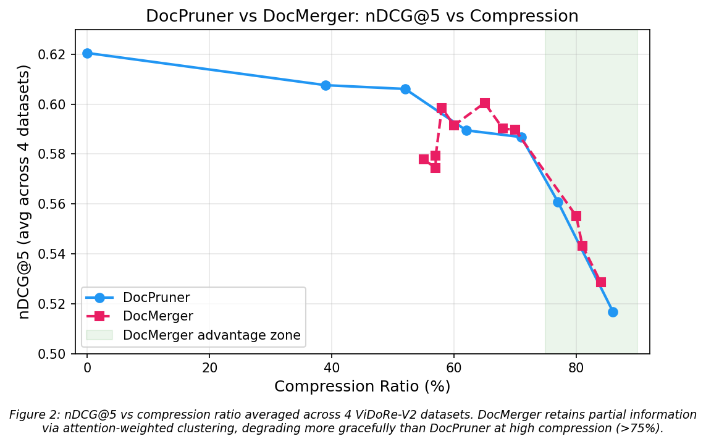

# DocMerger: Adaptive Hierarchical Patch Merging for Multi-Vector Visual Document Retrieval

## Overview

Multi-vector Visual Document Retrieval (VDR) systems represent each document page as hundreds of patch-level embeddings, achieving state-of-the-art retrieval quality but incurring prohibitive storage overhead. Recent work (DocPruner) addresses this via adaptive pruning, but permanently discards information, leading to sharp performance degradation at high compression ratios (>60%).

**DocMerger** introduces importance-aware tri-level partitioning that **preserves** high-importance patches, **merges** mid-importance patches via attention-weighted clustering, and **discards** low-importance ones. This hybrid approach retains partial information at high compression ratios where pure pruning fails.

## Key Results

| Method | Compression | Avg nDCG@5 | vs Baseline |
|--------|-------------|------------|-------------|
| No compression | 0% | 0.6205 | — |
| DocPruner (k=-0.25) | ~52% | 0.6061 | −0.014 |
| DocPruner (k=0.25) | ~71% | 0.5868 | −0.034 |
| **DocMerger** (k1=0.5,k2=0,mr=0.5) | **~70%** | **0.5897** | **−0.031** |
| DocPruner (k=1.0) | ~86% | 0.5168 | −0.104 |
| **DocMerger** (k1=1.0,k2=0,mr=0.1) | **~84%** | **0.5285** | **−0.092** |

DocMerger outperforms DocPruner at high compression (>75%), with the largest per-dataset gain of +0.027 nDCG@5 on ESG reports at ~80% compression.



See [docs/exp_results.md](docs/exp_results.md) for full results across all 4 ViDoRe-V2 datasets.

## Experiment Scope

| | Choice | Rationale |
|---|--------|-----------|
| Benchmark | ViDoRe-V2 | DocPruner's primary benchmark, 4 English datasets |
| Model | ColQwen2.5 (`vidore/colqwen2.5-v0.2`) | Most widely used, best community support |
| Metric | nDCG@5 | Standard in VDR literature |
| Hardware | MacBook Pro 36GB (MPS) | |

## Project Structure

```
project_6765/
├── readme.md
├── pyproject.toml              # uv-managed dependencies
├── docpruner_replicate.py      # All-in-one: encoding, pruning, merging, evaluation
├── docs/
│   ├── exp_results.md          # Full experiment results + analysis
│   └── research_plan.md        # Future research directions
├── scripts/
│   ├── 03_plot_results.py      # Static matplotlib figure
│   └── 04_plot_interactive.py  # Interactive Plotly figure
├── results/
│   └── figures/                # Generated plots
├── original_files/             # Reference implementations
└── new_adapted_files/          # Adapted scripts
```

## Quick Start

```bash
# Install dependencies
uv sync

# Run baseline (no compression) on one dataset
uv run python docpruner_replicate.py \
    --dataset vidore/esg_reports_v2 \
    --pruner identity \
    --batch-doc 1 --batch-query 4

# Run DocPruner
uv run python docpruner_replicate.py \
    --dataset vidore/esg_reports_v2 \
    --pruner docpruner --k -0.25

# Run DocMerger
uv run python docpruner_replicate.py \
    --dataset vidore/esg_reports_v2 \
    --pruner docmerger --k1 1.0 --k2 0 --merge-ratio 0.25

# Run DocMerger (simple average ablation)
uv run python docpruner_replicate.py \
    --dataset vidore/esg_reports_v2 \
    --pruner docmerger_avg --k1 1.0 --k2 0 --merge-ratio 0.25

# Run full sweep (all datasets × all DocPruner k values)
uv run python docpruner_replicate.py --run-all

# Generate plots
uv run python scripts/03_plot_results.py
uv run python scripts/04_plot_interactive.py
```

Embeddings are cached after the first run (~77 min on MPS per dataset). Subsequent compression experiments take seconds.

## Method

```
Given importance scores I(d_j) with mean μ and std σ:

P_preserve = { d_j | I(d_j) > μ + k1·σ }              → keep as-is
P_merge    = { d_j | μ - k2·σ < I(d_j) ≤ μ + k1·σ }   → cluster + weighted merge
P_discard  = { d_j | I(d_j) ≤ μ - k2·σ }              → remove

Final embeddings D' = P_preserve ∪ {merged centroids}
```

Merging uses agglomerative clustering (cosine distance) on P_merge, with centroids weighted by EOS attention importance.

### Why DocMerger wins at high compression

At moderate compression (<60%), DocPruner keeps the best patches untouched and outperforms merging. At high compression (>75%), DocPruner must discard too many patches, permanently losing information. DocMerger routes those patches through the merge tier — cluster centroids are imperfect but carry more signal than nothing. Merging is worse than keeping the original, but better than discarding.

## Experiment Progress

- [x] Phase 1 — Setup & embedding extraction (4 datasets cached)
- [x] Phase 2 — DocPruner baselines (6 k values × 4 datasets)
- [x] Phase 3 — DocMerger implementation + sweep (36 configs on ESG, top configs on all datasets)
- [x] Phase 3 — Ablation: attention-weighted vs simple-average merge
- [ ] Phase 4 — Report writing + presentation

## Future Directions

See [docs/research_plan.md](docs/research_plan.md) for detailed plans. Three directions:

1. **Adaptive Hybrid** — Per-document selection between DocPruner and DocMerger based on attention entropy. Addresses DocMerger's weakness at low compression with zero training cost.
2. **Residual Merging** — Store centroid + rank-1 PCA residual per cluster. Recovers fine-grained information lost by averaging, at minimal storage overhead.
3. **Learned Sparse Projection** — Train a lightweight linear layer to compress merge-tier patches, optimized via MaxSim distillation loss. End-to-end optimized for retrieval.

## References

- [DocPruner](https://arxiv.org/abs/2509.23883) — Yan et al., 2025
- [ColPali](https://arxiv.org/abs/2407.01449) — Faysse et al., 2024
- [ViDoRe-V2](https://arxiv.org/abs/2505.17166) — Macé et al., 2025
- [vidore-benchmark](https://github.com/illuin-tech/vidore-benchmark)
- [colpali-engine](https://github.com/illuin-tech/colpali)
